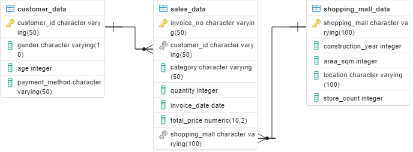
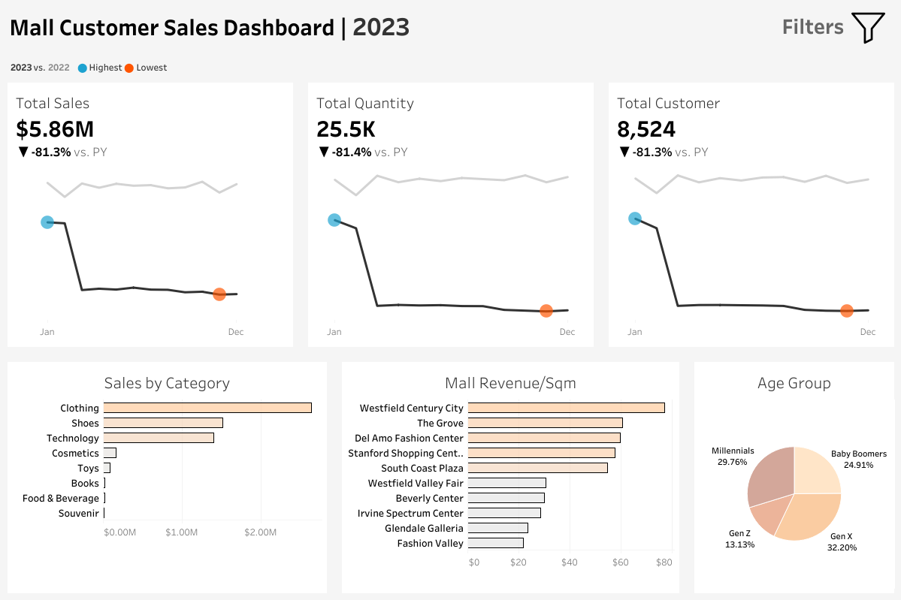
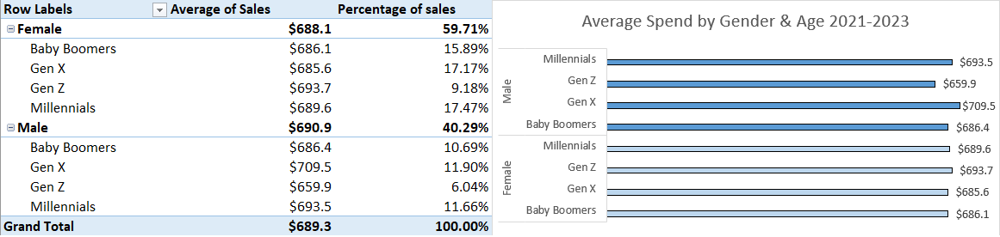
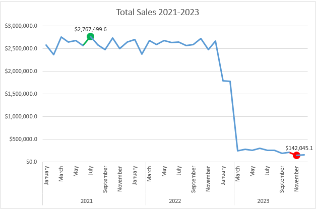
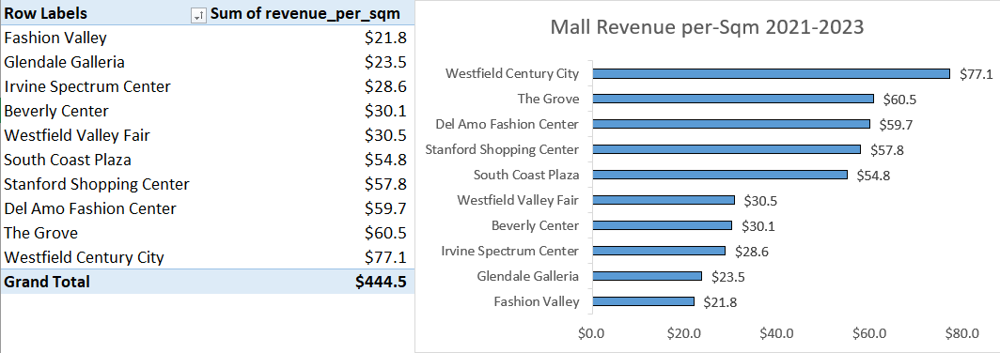

# Table of Contents

1. [Project Background](#project-background)
2. [Data Structure & Initial Checks](#data-structure--initial-checks)
3. [Executive Summary](#executive-summary)
4. [Insight Deep Dive](#insight-deep-dive)
5. [Recommendation](#recommendation)
6. [Clarifying Questions, Assumptions, and Caveats](#clarifying-questions-assumptions-and-caveats)

# Project Background
The retail industry in California is facing significant challenges due to evolving consumer behaviors, economic fluctuations, and the rise of e-commerce. Shopping malls, in particular, are under pressure to adapt and remain competitive. This project aims to analyze three key datasets—Sales Data, Customer Data, and Shopping Mall Data—to provide actionable insights that can help stakeholders address these challenges.

The primary goal is to conduct an in-depth analysis of the provided datasets to identify key trends, patterns, and anomalies. The insights derived will inform actionable recommendations for optimizing sales strategies, enhancing customer engagement, and improving overall mall performance. The ultimate aim is to stabilize and potentially reverse the downward trend observed in recent years.

The datasets used are from Kaggle and can be found [here](https://www.kaggle.com/datasets/captaindatasets/istanbul-mall/data).

An interactive Tableau Dashboard can be found [here](https://public.tableau.com/app/profile/deva.pratama/viz/MallCustomerSalesDashboard/SalesCustomerMallDashboard?publish=yes).

The data cleaning and data inspection using python can be found [here](https://github.com/devapratama/mall-customer-sales-analysis/blob/master/data_cleaning_pipeline.ipynb).

SQL queries for analyzing deep dives can be found [here](https://github.com/devapratama/mall-customer-sales-analysis/blob/master/mall_customer_sales_deepdive.sql), as well as excel files can be found [here](https://github.com/devapratama/mall-customer-sales-analysis/blob/master/mall_customer_sales_analysis.xlsx).

---

# Data Structure & Initial Checks

The following is the ERD of the datasets:

The Entity-Relationship Diagram (ERD) illustrates the relationships between the three main datasets:
- Customer Data: Contains demographic details such as gender, age, and payment method.
- Sales Data: Records transaction-level details including invoice number, customer ID, product category, quantity, invoice date, total price, and shopping mall.
- Shopping Mall Data: Provides information on each mall, including construction year, area, location, and store count.

Initial checks include ensuring data integrity by verifying for missing values, incorrect data types, and inconsistencies. The data cleaning and data inspection using python can be found [here](https://github.com/devapratama/mall-customer-sales-analysis/blob/master/data_cleaning_pipeline.ipynb).

---

# Executive Summary

In 2021, total sales reached $31.30M with steady customer footfall, while 2022 saw a marginal increase to $31.35M, indicating relative stability in the market. However, 2023 witnessed a dramatic decline, with total sales plummeting to $5.86M—a staggering 81.3% decrease compared to the previous year. This sharp drop is mirrored in total quantity sold and customer visits, both of which fell by over 81%. The analysis highlights that Westfield Century City consistently outperforms other malls in revenue per square meter, while Clothing remains the top-selling category. To address this concerning trend, it is imperative to implement targeted marketing strategies for high-spending demographics like Gen X males and female Millennials, optimize product mix to include more high-value categories such as Technology, and enhance operational efficiencies in key malls. These recommendations aim to stabilize and potentially reverse the downward trajectory observed in 2023.

Below is the overview page from Tableau dashboard. The tableau dashboard can be found [here](https://public.tableau.com/app/profile/deva.pratama/viz/MallCustomerSalesDashboard/SalesCustomerMallDashboard?publish=yes).

---

# Insight Deep Dive

## Customer Behavior Analysis

- **Average Purchase Value by Gender and Age Group**: The analysis reveals that Male Gen X customers have the highest average purchase value at $702.89, indicating a strong spending capacity within this demographic. Female Millennials, despite having a slightly lower average spend of $689.92, represent the largest customer segment with 18.61% of total customers, highlighting their significant market share. This suggests that targeted marketing strategies should focus on both high-spending Gen X males and the large pool of Millennial females to maximize revenue.

- **Category Preferences by Gender**: Clothing is the most popular category for both genders, accounting for 34.72% of female purchases and 34.61% of male purchases. However, the average purchase value for shoes is notably higher, especially for females at $1801.01 compared to $1816.74 for males. Technology also commands a high average purchase value ($3161.98 for females and $3149.48 for males), despite lower purchase frequency. These insights suggest that while clothing drives volume, focusing on high-value categories like shoes and technology can significantly boost overall revenue.

- **Seasonal Shopping Patterns by Age Group**: Baby Boomers exhibit consistent shopping behavior throughout the year, with January being the peak month (10.29% of purchases). In contrast, Gen Z shows more volatility, with October experiencing the highest average purchase value at $742.91. Gen X maintains relatively stable spending patterns, with July seeing the highest average purchase value at $717.81. Understanding these seasonal trends can help tailor promotional activities and inventory management to align with peak shopping periods for each age group.

- **Payment Method Analysis by Total Value and Customer Count**: Cash remains the dominant payment method, used by 44.69% of customers and generating 44.79% of total revenue, with an average transaction value of $690.82. Credit cards follow closely behind, used by 35.12% of customers and contributing 35.09% of revenue. Debit cards, while less popular, still account for a significant portion of transactions. The similarity in average transaction values across payment methods suggests that customer choice of payment method may be influenced by convenience rather than transaction size. Retailers should ensure robust support for all payment methods to cater to diverse customer preferences.

## Sales Performance Analysis

- **Quarterly Sales Trend with Moving Average**: The quarterly sales trend analysis reveals a concerning decline in revenue, particularly pronounced in Q1 2023, where revenue plummeted by 51.52% compared to the previous year. The moving average indicates a steady performance until 2022, but the sharp drop in 2023 suggests an urgent need for intervention. This dramatic shift could be attributed to external factors such as economic downturns or changes in consumer behavior, necessitating a thorough investigation and strategic adjustments.

- **Monthly Revenue Growth**: Monthly revenue growth shows a relatively stable pattern from 2021 to 2022, with fluctuations within a reasonable range. However, the drastic decline starting in January 2023, with a -32.74% drop, marks a significant departure from previous trends. The subsequent months continue to show negative growth, indicating a persistent issue that requires immediate attention. Identifying the root cause of this decline is crucial for developing effective countermeasures.

- **Category Performance Analysis**: Clothing remains the top-performing category, contributing 45.33% of total revenue, followed by Shoes (26.46%) and Technology (23.01%). The high average transaction value for Shoes ($1807.39) and Technology ($3156.94) underscores their importance despite lower sales volume. Conversely, categories like Cosmetics, Toys, and Food & Beverage have significantly lower revenue contributions and average transaction values, suggesting potential areas for improvement in product mix and marketing strategies.

- **Category Performance by Day of Week**: Clothing and Shoes exhibit strong performance across most days of the week, with consistently high sales counts and average transaction values. For instance, Clothing generates over $4 million in revenue on both Mondays and Saturdays, while Shoes achieve similar results on Fridays and Tuesdays. In contrast, categories like Books, Cosmetics, and Food & Beverage show lower sales and revenue, indicating a need for targeted promotions or placement adjustments to boost their performance. Understanding these day-specific patterns can help optimize inventory management and staffing levels to align with peak demand periods.

## Mall Performance Analysis

- **Mall Performance Overview (Revenue, Traffic, Efficiency)**: Westfield Century City stands out as the top-performing mall with the highest revenue per square meter ($77.07) and revenue per store ($51249.90), indicating strong efficiency and customer appeal. The Grove follows closely with a revenue per square meter of $60.54, suggesting that these malls have successfully optimized their space and tenant mix to maximize revenue. However, malls like Fashion Valley and Glendale Galleria show lower efficiency metrics, highlighting areas for potential improvement in layout and store selection.

- **Mall Age Impact Analysis**: The analysis reveals that older malls like Del Amo Fashion Center (64 years old) and Stanford Shopping Center (69 years old) still maintain high average transaction values ($694.57 and $682.81 respectively), indicating that age does not necessarily correlate with performance. Younger malls like The Grove (23 years old) also perform well, suggesting that factors such as location, marketing strategies, and tenant mix play a more significant role in mall success than age alone.

- **Space Efficiency Analysis**: Westfield Century City demonstrates exceptional space efficiency with a revenue per square meter of $77.07 and transactions per 1000 sqm of 112.86, making it a benchmark for other malls. In contrast, malls like Westfield Valley Fair and Beverly Center exhibit lower space efficiency, with revenue per square meter at $30.53 and $30.05 respectively. This disparity suggests that optimizing space utilization through strategic tenant placement and design can significantly enhance overall mall performance.

- **Location Performance Analysis**: Malls located in Los Angeles collectively generate the highest total revenue ($16,976,462.20) and have the highest average transaction value ($685.39), underscoring the importance of location in driving sales. Torrance and Costa Mesa also show strong performance, with Del Amo Fashion Center and South Coast Plaza contributing significantly to their respective locations' revenue. These insights highlight the need for tailored strategies based on local market conditions and consumer preferences.

- **Mall Category Specialization**: Clothing remains the dominant category across most malls, accounting for a significant portion of revenue (e.g., 47.12% at Beverly Center and 45.09% at Del Amo Fashion Center). Shoes and Technology follow as key contributors, indicating a consistent demand for these product categories. However, smaller categories like Cosmetics, Toys, and Food & Beverage contribute less than 3% of revenue, suggesting opportunities for diversification and targeted promotions to boost their performance.

- **Mall Customer Demographics Analysis**: Millennials and Gen X customers are the primary drivers of revenue across most malls, with high average transaction values and significant customer counts. For instance, at Westfield Century City, Millennial females spend an average of $685.27 per transaction, contributing substantially to the mall's revenue. Understanding the spending patterns and preferences of these demographics is crucial for developing effective marketing and retail strategies. Additionally, the presence of Baby Boomers and Gen Z indicates a diverse customer base, requiring a balanced approach to cater to different age groups.

---

# Recommendation

To address the identified issues and achieve the project goals, the following strategic recommendations are proposed:

- **Targeted Marketing Campaigns**: Develop personalized marketing initiatives aimed at high-spending demographics such as Male Gen X and Female Millennials. These campaigns should leverage their spending habits and preferences to drive higher sales.
- **Product Mix Optimization**: Increase the focus on high-value categories like Technology, which commands significantly higher revenue despite lower sales frequency. This can help boost overall revenue and profitability.
- **Operational Enhancements**: Improve space utilization and tenant mix in top-performing malls like Westfield Century City. Strategies could include attracting more high-revenue-generating stores and optimizing layout to enhance customer experience.
- **Seasonal Sales Strategies**: Implement robust promotional activities during Q1, a period that historically drives a substantial portion of annual sales. Tailored promotions can help capitalize on seasonal trends and mitigate revenue volatility.
- **Customer Retention Programs**: Introduce loyalty programs and incentives to retain existing customers, especially those who have shown consistent spending behavior. This can help build long-term customer relationships and stabilize sales.

---

# Clarifying Questions, Assumptions, and Caveats

## Clarifying Questions for Stakeholders:
- What specific factors do you believe contributed to the significant drop in sales in 2023? Understanding external factors such as economic conditions, competitor actions, or changes in consumer behavior can provide context for the analysis.
- Are there any planned changes or initiatives (e.g., new store openings, renovations) that could impact future sales and customer behavior? Knowing about upcoming changes can help align the analysis and recommendations with broader business strategies.
- What are the current marketing and operational strategies being employed, and how effective have they been? Evaluating existing strategies can help identify areas for improvement and inform new recommendations.

## Assumptions:
- The provided datasets are accurate and representative of the overall business operations.
- Economic conditions and consumer behavior remain relatively stable in the near future, allowing for reliable forecasting based on historical data.
- Stakeholders are committed to implementing the recommended strategies and providing necessary resources for their execution.

## Caveats:
- The analysis is based on historical data and may not fully account for unforeseen future events or market disruptions.
- Recommendations are based on observed trends and may require adjustments based on real-world implementation and feedback.
- The effectiveness of the proposed strategies depends on various internal and external factors, including market competition, economic conditions, and customer preferences. Continuous monitoring and evaluation will be essential to ensure success.
